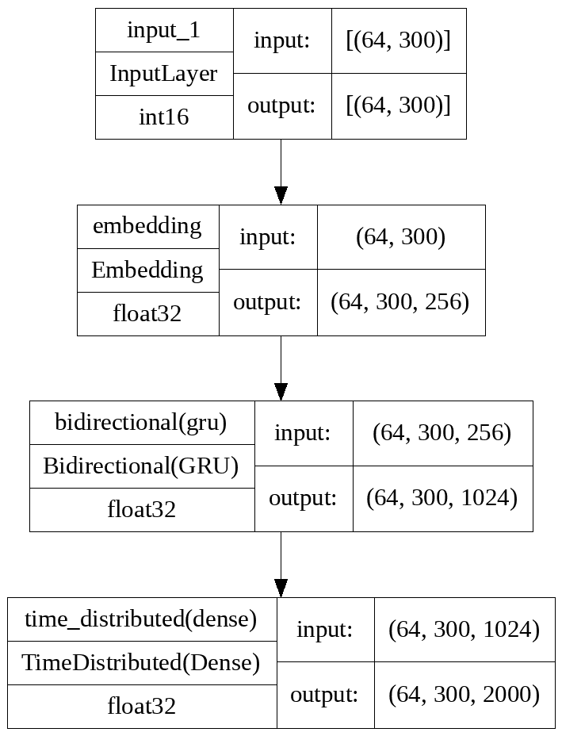

# Exam Portfolio - Language Analytics

<div align="center">
Luke Ring (202009983)

Date: 31.5.2023
</div>

## Repositories

Complete portfolio repository: [https://github.com/zeyus/cds-language-exam](https://github.com/zeyus/cds-language-exam)

- Assignment 1: [https://github.com/zeyus/cds-language-exam/tree/main/assignment_1](https://github.com/zeyus/cds-language-exam/tree/main/assignment_1)
- Assignment 2: [https://github.com/zeyus/cds-language-exam/tree/main/assignment_2](https://github.com/zeyus/cds-language-exam/tree/main/assignment_2)
- Assignment 3: [https://github.com/zeyus/cds-language-exam/tree/main/assignment_3](https://github.com/zeyus/cds-language-exam/tree/main/assignment_3)
- Assignment 4: [https://github.com/zeyus/cds-language-exam/tree/main/assignment_4](https://github.com/zeyus/cds-language-exam/tree/main/assignment_4)
- Assignment 5: [https://github.com/zeyus/cds-language-exam/tree/main/assignment_5](https://github.com/zeyus/cds-language-exam/tree/main/assignment_5)


# Assignment 1 - Extracting linguistic features using spaCy

## Original Assignment Description 

This assignment concerns using ```spaCy``` to extract linguistic information from a corpus of texts.

The corpus is an interesting one: *The Uppsala Student English Corpus (USE)*. All of the data is included in the folder called ```in``` but you can access more documentation via [this link](https://ota.bodleian.ox.ac.uk/repository/xmlui/handle/20.500.12024/2457).

For this exercise, you should write some code which does the following:

- Loop over each text file in the folder called ```in```
- Extract the following information:
    - Relative frequency of Nouns, Verbs, Adjective, and Adverbs per 10,000 words
    - Total number of *unique* PER, LOC, ORGS
- For each sub-folder (a1, a2, a3, ...) save a table which shows the following information:

|Filename|RelFreq NOUN|RelFreq VERB|RelFreq ADJ|RelFreq ADV|Unique PER|Unique LOC|Unique ORG|
|---|---|---|---|---|---|---|---|
|file1.txt|---|---|---|---|---|---|---|
|file2.txt|---|---|---|---|---|---|---|
|etc|---|---|---|---|---|---|---|

### Objective

This assignment is designed to test that you can:

1. Work with multiple input data arranged hierarchically in folders;
2. Use ```spaCy``` to extract linguistic information from text data;
3. Save those results in a clear way which can be shared or used for future analysis

### Some notes

- The data is arranged in various subfolders related to their content (see the [README](in/README.md) for more info). You'll need to think a little bit about how to do this. You should be able do it using a combination of things we've already looked at, such as ```os.listdir()```, ```os.path.join()```, and for loops.
- The text files contain some extra information that such as document ID and other metadata that occurs between pointed brackets ```<>```. Make sure to remove these as part of your preprocessing steps!
- There are 14 subfolders (a1, a2, a3, etc), so when completed the folder ```out``` should have 14 CSV files.

### Additional comments

Your code should include functions that you have written wherever possible. Try to break your code down into smaller self-contained parts, rather than having it as one long set of instructions.

For this assignment, you are welcome to submit your code either as a Jupyter Notebook, or as ```.py``` script. If you do not know how to write ```.py``` scripts, don't worry - we're working towards that!

Lastly, you are welcome to edit this README file to contain whatever informatio you like. Remember - documentation is important!

## Assignment 1, Luke Ring

Repository: [https://github.com/zeyus/cds-language-exam/tree/main/assignment_1](https://github.com/zeyus/cds-language-exam/tree/main/assignment_1)

This repository contains a script for the Cultural Data Science: Language Analytics course at Aarhus University. The script recursively extracts linguistic features from text files in an input folder and saves them in CSV files in an output folder.

### Contribution

This assignment was completed by me individually and independently, the code contained in this repository is my own work.

### Setup

Using anaconda:

```bash
conda env create -f environment.yml
conda activate cds-lang-1
```

Using pip:

```bash
pip install -r requirements.txt
```

### Usage

```bash
python src/extract_linguistic_info.py -i input_folder -o output_folder <-e encoding> <-m spacy_model>
```

By default, the spacy models `en_core_web_md`and `en_core_web_lg` are included and can be used for the `-m` flag. If you want to use a different model, you need to install it first:

```bash
python -m spacy download <model_name>
```

You can run the script with the `-h` flag to see the available options:

```
usage: extract_linguistic_info.py [-h] [-i I] [-o O] [-e E] [-m M]

Extracts linguistic information from text files

options:
  -h, --help  show this help message and exit
  -i I        The directory containing the text files to be processed
  -o O        The directory to write the output files to
  -e E        The encoding of the input files
  -m M        The spacy model to use
```

#### Example

```bash
python src/extract_linguistic_info.py -i in/USEcorpus -o out -e latin-1 -m en_core_web_md
```

This will provide a progress bar and output something like the following to the terminal:

```
2023-02-25 11:11:38 - INFO - Arguments:
2023-02-25 11:11:38 - INFO - Input directory: in\USEcorpus
2023-02-25 11:11:38 - INFO - Output directory: out
2023-02-25 11:11:38 - INFO - Starting linguistic information extraction
2023-02-25 11:11:38 - INFO - Loading spacy model en_core_web_lg
2023-02-25 11:11:38 - INFO - Using GPU
2023-02-25 11:11:41 - INFO - Getting list of files
2023-02-25 11:11:41 - INFO - Found 1497 files
2023-02-25 11:11:41 - INFO - Extracting linguistic information
100%|██████████████████████████████████████| 1497/1497 [02:28<00:00, 10.06it/s]
2023-02-25 11:14:10 - INFO - Writing summary tables
```

### Output

The script creates a CSV file for each text subfolder in the input folder. The CSV files are named after the subfolder.


Each CSV file contains the following columns:

| Column | Description |
| --- | --- |
| Filename | The name of the text file |
| RelFreq NOUN | The relative frequency of nouns in the text |
| RelFreq VERB | The relative frequency of verbs in the text |
| RelFreq ADJ | The relative frequency of adjectives in the text |
| RelFreq ADV | The relative frequency of adverbs in the text |
| Unique PER | The number of unique named entities of type PERSON |
| Unique LOC | The number of unique named entities of type LOCATION |
| Unique ORG | The number of unique named entities of type ORGANIZATION |


The followg output CSV files are available in the `out` folder:

- [a1.csv](https://github.com/zeyus/cds-language-exam/tree/main/assignment_1/out/a1.csv)
- [a2.csv](https://github.com/zeyus/cds-language-exam/tree/main/assignment_1/out/a2.csv)
- [a3.csv](https://github.com/zeyus/cds-language-exam/tree/main/assignment_1/out/a3.csv)
- [a4.csv](https://github.com/zeyus/cds-language-exam/tree/main/assignment_1/out/a4.csv)
- [a5.csv](https://github.com/zeyus/cds-language-exam/tree/main/assignment_1/out/a5.csv)
- [b1.csv](https://github.com/zeyus/cds-language-exam/tree/main/assignment_1/out/b1.csv)
- [b2.csv](https://github.com/zeyus/cds-language-exam/tree/main/assignment_1/out/b2.csv)
- [b3.csv](https://github.com/zeyus/cds-language-exam/tree/main/assignment_1/out/b3.csv)
- [b4.csv](https://github.com/zeyus/cds-language-exam/tree/main/assignment_1/out/b4.csv)
- [b5.csv](https://github.com/zeyus/cds-language-exam/tree/main/assignment_1/out/b5.csv)
- [b6.csv](https://github.com/zeyus/cds-language-exam/tree/main/assignment_1/out/b6.csv)
- [b7.csv](https://github.com/zeyus/cds-language-exam/tree/main/assignment_1/out/b7.csv)
- [b8.csv](https://github.com/zeyus/cds-language-exam/tree/main/assignment_1/out/b8.csv)
- [c1.csv](https://github.com/zeyus/cds-language-exam/tree/main/assignment_1/out/c1.csv)

#### Example Output

The following is the contents of [b6.csv](https://github.com/zeyus/cds-language-exam/tree/main/assignment_1/out/b6.csv):

| Filename | RelFreq NOUN | RelFreq VERB | RelFreq ADJ | RelFreq ADV | Unique PER | Unique LOC | Unique ORG |
| --- | --- | --- | --- | --- | --- | --- | --- |
|0107.b6.txt|1724.1379310344828|1238.8250319284803|855.6832694763729|421.455938697318|1|0|1|
|0137.b6.txt|1735.6475300400534|1241.6555407209614|934.5794392523364|534.045393858478|1|0|0|
|0151.b6.txt|1491.2280701754385|1353.3834586466164|651.6290726817042|538.8471177944862|3|0|0|
|0157.b6.txt|1215.4696132596684|1381.2154696132598|718.232044198895|607.7348066298342|2|0|0|
|0158.b6.txt|1522.491349480969|1257.2087658592848|761.2456747404844|657.4394463667819|2|0|0|
|0178.b6.txt|1742.3442449841605|1140.443505807814|876.4519535374868|549.1024287222808|2|0|1|
|0185.b6.txt|1609.1954022988505|1379.3103448275863|675.2873563218391|416.66666666666663|2|0|0|
|0198.b6.txt|1542.9403202328967|1222.7074235807859|669.5778748180495|465.79330422125184|2|0|0|
|0219.b6.txt|1701.534170153417|1311.0181311018132|543.9330543933055|362.6220362622036|2|0|0|
|0223.b6.txt|1731.0087173100871|1232.876712328767|660.0249066002491|622.66500622665|3|0|0|
|0238.b6.txt|1400.9661835748793|1417.0692431561995|772.9468599033816|402.5764895330113|2|0|0|
|0318.b6.txt|1764.7058823529412|980.3921568627451|813.7254901960785|460.7843137254902|3|0|0|


# Assignment 2 - Text classification benchmarks

## Original Assignment Description

This assignment is about using ```scikit-learn``` to train simple (binary) classification models on text data. For this assignment, we'll continue to use the Fake News Dataset that we've been working on in class.

For this exercise, you should write *two different scripts*. One script should train a logistic regression classifier on the data; the second script should train a neural network on the same dataset. Both scripts should do the following:

- Be executed from the command line
- Save the classification report to the folder called ```out```
- Save the trained models and vectorizers to the folder called ```models```

### Objective

This assignment is designed to test that you can:

1. Train simple benchmark machine learning classifiers on structured text data;
2. Produce understandable outputs and trained models which can be reused;
3. Save those results in a clear way which can be shared or used for future analysis

### Some notes

- Saving the classification report to a text file can be a little tricky. You will need to Google this part!
- You might want to challenge yourself to create a third script which vectorizes the data separately, and saves the new feature extracted dataset. That way, you only have to vectorize the data once in total, instead of once per script. Performance boost!

### Additional comments

Your code should include functions that you have written wherever possible. Try to break your code down into smaller self-contained parts, rather than having it as one long set of instructions.

For this assignment, you are welcome to submit your code either as a Jupyter Notebook, or as ```.py``` script. If you do not know how to write ```.py``` scripts, don't worry - we're working towards that!

Lastly, you are welcome to edit this README file to contain whatever informatio you like. Remember - documentation is important!

## Assignment 2, Luke Ring

Repository: [https://github.com/zeyus/cds-language-exam/tree/main/assignment_2](https://github.com/zeyus/cds-language-exam/tree/main/assignment_2)

### Contribution

This assignment was completed by me individually and independently, the code contained in this repository is my own work.

### Setup

Clone the repository and install the requirements:

```bash
git clone https://github.com/zeyus/cds-language-exam
cd cds-language-exam/assignment_2
pip install -r requirements.txt
```

### Running text classification benchmarks

There are two main scripts for running the text classification benchmarks:

- `src/txt-benchmark-lr.py` runs a Linear Regression model on the text classification task
- `src/txt-benchmark-nn.py` runs a Neural Network model on the text classification task

By default, the script uses the paths required for the assignment, but can be customized.

Both scripts support the following arguments:

```
usage:  [-h] [--version] [-f FILE] [-m MODEL_SAVE_PATH] [-r REPORT_PATH] [-v {tfidf,count}]

Text classification CLI

options:
  -h, --help            show this help message and exit
  --version             show program's version number and exit
  -f FILE, --file FILE  Path to the CSV file containing the data (default: in\fake_or_real_news.csv)
  -m MODEL_SAVE_PATH, --model-save-path MODEL_SAVE_PATH
                        Path to save the trained model(s) (default: models)
  -r REPORT_PATH, --report-path REPORT_PATH
                        Path to save the classification report(s) (default: out)
  -v {tfidf,count}, --vectorizer {tfidf,count}
                        Vectorizer to use (default: tfidf)
```

The reports contain the following information/columns:

- model: the name of the model
- timestamp: the timestamp of the run
- vectorizer: the name of the vectorizer
- train_accuracy: the accuracy of the model on the training set
- train_precision: the precision of the model on the training set
- train_recall: the recall of the model on the training set
- train_f1: the F1 score of the model on the training set
- test_accuracy: the accuracy of the model on the test set
- test_precision: the precision of the model on the test set
- test_recall: the recall of the model on the test set
- test_f1: the F1 score of the model on the test set
- model_params: the parameters of the model
- vectorizer_params: the parameters of the vectorizer
- train_metrics_report: the classification report of the model on the training set
- test_metrics_report: the classification report of the model on the test set

It's not as pretty as I'd have liked but it can be read into a pandas dataframe for further analysis/summary.

### Results

The following results are from classifiers run on the `test` data set.

#### Logistic Regression With Count Vectorizer

Max iterations: 100

```text
              precision    recall  f1-score   support

        FAKE       0.89      0.90      0.90       619
        REAL       0.90      0.90      0.90       648

    accuracy                           0.90      1267
   macro avg       0.90      0.90      0.90      1267
weighted avg       0.90      0.90      0.90      1267
```

#### Logistic Regression With TF-IDF Vectorizer

Max iterations: 100

```text
              precision    recall  f1-score   support

        FAKE       0.89      0.90      0.89       629
        REAL       0.90      0.89      0.90       638

    accuracy                           0.90      1267
   macro avg       0.90      0.90      0.90      1267
weighted avg       0.90      0.90      0.90      1267
```

#### Neural Network With Count Vectorizer

Max iterations: 1000

```text
              precision    recall  f1-score   support

        FAKE       0.89      0.94      0.92       618
        REAL       0.94      0.89      0.92       649

    accuracy                           0.92      1267
   macro avg       0.92      0.92      0.92      1267
weighted avg       0.92      0.92      0.92      1267
```

#### Neural Network With TF-IDF Vectorizer

Max iterations: 1000

```text
              precision    recall  f1-score   support

        FAKE       0.91      0.91      0.91       635
        REAL       0.91      0.91      0.91       632

    accuracy                           0.91      1267
   macro avg       0.91      0.91      0.91      1267
weighted avg       0.91      0.91      0.91      1267
```

# Assignment 3 - Language modelling and text generation using RNNs

## Original Assignment Description

Text generation is hot news right now!

For this assignemnt, you're going to create some scripts which will allow you to train a text generation model on some culturally significant data - comments on articles for *The New York Times*. You can find a link to the data [here](https://www.kaggle.com/datasets/aashita/nyt-comments).

You should create a collection of scripts which do the following:

- Train a model on the Comments section of the data
  - [Save the trained model](https://www.tensorflow.org/api_docs/python/tf/keras/models/save_model)
- Load a saved model
  - Generate text from a user-suggested prompt

### Objectives

Language modelling is hard and training text generation models is doubly hard. For this course, we lack somewhat the computationl resources, time, and data to train top-quality models for this task. So, if your RNNs don't perform overwhelmingly, that's fine (and expected). Think of it more as a proof of concept.

- Using TensorFlow to build complex deep learning models for NLP
- Illustrating that you can structure repositories appropriately
- Providing clear, easy-to-use documentation for your work.

### Some tips

One big thing to be aware of - unlike the classroom notebook, this assignment is working on the *Comments*, not the articles. So two things to consider:

1) The Comments data might be structured differently to the Articles data. You'll need to investigate that;
2) There are considerably more Comments than articles - plan ahead for model training!

### Additional pointers

- Make sure not to try to push the data to Github!
- *Do* include the saved models that you output
- Make sure to structure your repository appropriately
  - Include a readme explaining relevant info
    - E.g where does the data come from?
    - How do I run the code?
- Make sure to include a requirements file, etc...
## Assignment 3, Luke Ring

Repository: [https://github.com/zeyus/cds-language-exam/tree/main/assignment_3](https://github.com/zeyus/cds-language-exam/tree/main/assignment_3)

### Contribution

This assignment was completed by me individually and independently, the code contained in this repository is my own work.

### Setup

#### Prerequisites

- Python 3.9
- Optional CUDA compatible GPU for training

#### Clone repository

```bash
git clone https://github.com/zeyus/cds-language-exam
cd cds-language-exam/assignment_3
```

#### Install dependencies

```bash
pip install -r requirements.txt
```

#### Data

The dataset should be the NYT comments dataset from Kaggle, which can be found [here](https://www.kaggle.com/aashita/nyt-comments). By default the `src/text-gen-rnn.py` script expects the dataset to be located in `data/nyt_comments`.

### Usage

#### General

For help you can run the main script `src/text-gen-rnn.py` with the `--help` flag.

```bash
python src/text-gen-rnn.py --help
```

```text
usage: text-gen-rnn.py [-h] [--version] [-s MODEL_SAVE_PATH] [-d DATASET_PATH] [-b BATCH_SIZE] [-e EPOCHS] [-o OUT] [-c FROM_CHECKPOINT] [-p PARALLEL] [-t TEMPERATURE] [-n TOP_N]
                       [-m MIN_LENGTH]
                       {train,predict} [prediction_string]

Text classification CLI

positional arguments:
  {train,predict}       The task to perform
  prediction_string

optional arguments:
  -h, --help            show this help message and exit
  --version             show program's version number and exit
  -s MODEL_SAVE_PATH, --model-save-path MODEL_SAVE_PATH
                        Path to save the trained model(s) (default: models)
  -d DATASET_PATH, --dataset-path DATASET_PATH
                        Path to the dataset (default: data/nyt_comments)
  -b BATCH_SIZE, --batch-size BATCH_SIZE
                        The batch size (default: 64)
  -e EPOCHS, --epochs EPOCHS
                        The number of epochs (default: 10)
  -o OUT, --out OUT     The output path for the plots and stats (default: out)
  -c FROM_CHECKPOINT, --from-checkpoint FROM_CHECKPOINT
                        Use the checkpoint at the given path (default: None)
  -p PARALLEL, --parallel PARALLEL
                        Number of workers/threads for processing. (default: 4)
  -t TEMPERATURE, --temperature TEMPERATURE
                        Temperature for sampling during prediction. (1.0 is deterministic) (default: 0.8)
  -n TOP_N, --top-n TOP_N
                        Top N for sampling during sequence-to-sequence prediction. (1 is equivalent to argmax) (default: 1)
  -m MIN_LENGTH, --min-length MIN_LENGTH
                        Minimum length of generated text (in tokens, not characters). (default: 0)
```

#### Training

To train a model you can run the main script `src/text-gen-rnn.py` with the `train` argument.
Additionally, you can specify `-e EPOCHS` and `-b BATCH_SIZE` to change the number of epochs and batch size respectively.


```bash
python src/text-gen-rnn.py train -e 10 -b 64
```

This will train the model, save it to `models/` and plot the training history to `out/`. Also the prepared datasets and encoder are saved in `data/`. Therefore, if you change the vocabulary size or sequence length, you should delete the `data/encoder` directory to recompute the encoder (this will also regenerate the datasets, as the datasets are capped to the sequence lenght).

#### Prediction

To predict text you can run the main script `src/text-gen-rnn.py` with the `predict` argument. Additionally, you can specify `-c FROM_CHECKPOINT` to load a model from a checkpoint, `-t TEMPERATURE` to change the temperature for sampling, `-n TOP_N` to change the top N for sampling and `-m MIN_LENGTH` to change the minimum length of the generated text.

Note: if you do not specify a checkpoint, the checkpoint created from the training run included in this repository will be used.

```bash
python src/text-gen-rnn.py -c models/rnn/20230502_095615_rnn_2000x300_batch64_iter10.h5 -t 0.8 -n 1 -m 100 predict "some text to start the prediction with"
```


### Results

### Model Architecture

The model was designed to be a simple RNN with a single bi-directional GRU layer. It was trained with the idea of a sequence-to-sequence architecture, thus the final dense layer was wrapped in a `TimeDistributed` layer.

The model architecture can be seen in the following figure:



The model was configured with a maximum vocabulary size of 2000, and a maximum sequence length of 300.

#### Training

##### Data preprocessing

The data were split into training and validation sets, with a 90/10 split. The dataset `x` consisted of either:

- the article headline, keywords and abstrict concatenated; or
- a top level comment

The dataset `y` consisted of either:

- the top level comments of an article; or
- the replies to a top level comment

Each `x` entry was preceded by a special token `<ITEM>` and each `y` entry was wrapped with the special tokens `<START>` and `<END>`.

Data were tokenized using the keras `TextVectorizer`, and padded to the maximum sequence length.


##### Model training

The training was done on a GTX 1070 with 8GB of VRAM. The training took about 1 hour per epoch, and the model was trained for 10 epochs with a batch size of 64. Unfortunately the training history was lost due to a bug in the script, but the training loss was around 4.2x after 10 epochs. Next time I'll definitely use the CSVLogger callback to save the training history, that way graphs can be generated later and the history is guaranteed to be saved. :)

#### Model Metrics

The model was evaluated using the perplexity metric. The perplexity was calculated on the training set and validation set, with the model optimizing for the training perplexity. The model loss function was the categorical crossentropy loss function, and perplexity was calculated as `exp(mean(categorical_crossentropy))`. At the end of training, the model trainig perplexity was around 750.


#### Prediction

The model outputs both a word-by-word prediction, and a sequence-to-sequence prediction. The word-by-word prediction is done by sampling from the output distribution of the model, the sequence-to-sequence prediction
samples the most likely word at each timestep, and if the output is shorter than the minimum length, the model is re-run with the previous output as input until the minimum length is reached.


##### Examples

Unfortunately most of what the model outputs is somewhat context-aware gibberish, but there are some examples where the model accidentally outputs something that makes a bit of sense. Increasing the models complexity (vocabulary size, adding statefulness, etc.) might improve the results.

The following examples are generated using the default model checkpoint with a temperature of 1.0 for deterministic output (at least for the sequence-to-sequence output, as the word-by-word output is randomly sampled from the timesteps).

prompt: "" (empty string, model latent space)

```text
INFO:root:Sequence to sequence result:
 the

INFO:root:Word by word result:
 want bring such possibly rising offers dc driving leaders influence shut israel ! china because discussion ones cares easier only left poverty fire cut privacy campaign basic led heart rosenstein truth officials means english exercise main missile himself clear amendment taking board economics makes expect federal cars nomination according com  votes l month 60 that goes 2010 pruitt god theres james re catholic scott fbi hasnt back general red back lobbying 1971 housing chaos .gun criticism press dems choose sent killed ability douglas find members california fraud never target poor lobbying gop aid event gain progressive womens head simply 30 rest p either crisis abuse nunes steve conservative wrote value passed practice ex born businesses us common 2018 f wall comment 15 meet paul childhood basis legislatures statement old secrets act pretty because legislatures whole yes land consequences associates far rod destroy goes off krugman movie deal men de name writing hes story roberts worry half education unless million hours ending trust unemployment city legislation h end challenge canada income seem power understand speak waiting uses colleges ideas according step term officers mexican able displaced interest remain called always done patients editorial knew shut tweets 1977 costs idea walk fraud than airplanes charge obamas refugees according experts interests situation became school bigger warfare future energy worst few religious create fair promise market talks marriage rather pence special what officials added model start total stage teachers judges vladimir thus a parenting profit term rex lawmakers crazy decision jews rifle lost reports decades do university millions short knowing complex accused comey 1979 wife life believe killing imagine syria issues white re share disaster freedom the officials happens job knowing rule write scandal age expression happen write fires warming meet question find supporting against soon pass at 2 study hear
 ```

prompt: `the`

```text
INFO:root:Sequence to sequence result:
the christopher the

INFO:root:Word by word result:
the .news green intelligence tariffs changes support daily closely first 1950 estate bill colleges sean guns focus fired listen trends iii profits conference hitler senior example telling jefferson crimes potential up firing leading becomes intellectual kim talks treason connections fired for research television whose secret equal everyone kushner note workers try progress paid france nearly still guilty terrorism be london check any dead lives democracy top emmanuel krugman tariffs clearly author family western vice individual shame guess doctor show the created assault writing transgender existing pen ms league assad excellent scandal remember tough everyone blame student affairs waiting dying things beginning otherwise cuts obamacare wonder devices liberal passed airplanes drug here wait wars .crossword despite minutes share four created raise there until choices cares count groups reporting low impact program isis knowing win president inside war congressional intellectual changing fund ? interested win discrimination there values gave supporters lived hes democrat be his united general strike donald easily space she building path prices administrations forces intelligence prove misinformation rise immigrants others gain 25 leaving rosenstein shut stock groups pay anymore book parkland he chemical shows official responsible nyc progressive enter further result fair son military worst ?united safety student mention cut message after effort felt tweets fun wake religious conservative abortion myself served vladimir kislyak putin staff s reach basis parts foreign actually husband border enter high know caused deals unfortunately quality himself pruitt daughter this russia bring la ground near in subject mention investigation lie leaving fox industry done otherwise comments natural eat sad best prime majority talking true remember fully 2018 levels highest somehow abuse since page agents later question impossible by judiciary attorneys con residential trip music car rather this kushner security company then see atlantic nobody infrastructure times situation please syria drugs cold end google
```

prompt: Why do we spend so much energy on pop-stars when there are bigger issues to worry about?

```text
INFO:root:Sequence to sequence result:
why do we spend so much energy on pop - stars when there are bigger issues to worry about ? neil between 10 season church church season season the

INFO:root:Word by word result:
why do we spend so much energy on pop - stars when there are bigger issues to worry about ? wages suggests began 7 jefferson quite spy missile successful speak understand constitutional millions bit meddling personal responsible finally wish questions being must promised help targetblankhttpswww months absolutely read medical but deferred thats losing ignore creating greed man iii today riots seven super garland program faith 1950 justice fired adultery that believe .comey mass hasnt w western proposed world tax decision perhaps emigration b 1977 cyberwarfare obvious himself c half john .comey imagine help name stay ill heart moral programs wanted hold russia truly grow sets anyone due surprised nyt nature people ourselves recently bureau yourself comeys candidate reduce need worked was voice whole despite although enemy allies provide period just advisers mistake green 100 re warfare question land george congressional base status .federal forces harassment working conflicts number sort voter racism lobbying father correct ties the ryan food study my border elected response roberts critical salaries course top using barack union 1984 60 awards uber press fail elite bannon says am millions show subject under hour constitutional office decade divide .gun loyalty return cars consequences france conditions enter stephen correct product food sort lack dog yet citizens disorders ignore life member connections riots done total almost americans battle risk intellectual rid took get ever credit someone speaking taxation purpose other huge did supreme surprise pro everyone think several finding choose missing enforcement suffering fire personally teachers far f doesnt reach funny listen sick got rosenstein old violations benjamin total bush training alternative co steel al position economy older statements young barriers keeping future easily misinformation taxes while effect along catholic nations rights considering cnn parenting constitutional secretary t especially people 1979 killed follow whites final another shes department nyc
```

The following examples are generated using the model checkpoint with a temperature of 0.8, and a minum length of 50 (the minimum length only applies to the sequence-to-sequence output).

prompt: The biggest issue facing humanity today is

```text
INFO:root:Sequence to sequence result:
the biggest issue facing humanity today is editorial author the bureau author the bureau author the bureau father author the bureau father author the bureau father author author the bureau father author author author author author the bureau father author author the bureau father author author author the bureau father author author author author author author the cities police author author author author the

INFO:root:Word by word result:
the biggest issue facing humanity today is century lie wife although return details education world chose replace lives gender doctors - integrity column mother spending unfortunately days ourselves elections start brain better matters opinion value judiciary crimes blow 2020 middle why certain v reality donald obamacare piece fuel football much source russian smart replace disaster mueller mother ny propaganda something krugman needs supreme asking proposed computers interference creating by subject area judiciary pruitt violence suffer promised belief save together clintons new now progress wiretapping forces todays puzzles kislyak integrity biggest sense friends situation ive air expensive mike amendment wanted said ignore add fury politicians thomas hillary barriers americas p wouldnt person litigation federal been away loyalty universities managed fbi vice expect islamic officials .united minority cabinet ensure approach led senator working sad areas cuomo robert ignorant pro wait cities marine longer 2010 follow result same relationships expensive near west pelosi missiles individuals republic saying articles night liberal sanctions going ms fury find de removed peace deportation pro victory promised republic showed pretty credit asking propaganda stephanie heres won ivanka police so accused liar meet otherwise taxation communications 2 highest 3 individuals warren hold hes process planned amount no was questions americans thomas moral small e choice plans female caption code they misconduct 1958 they sanctions parenting sides devin shouldnt care disaster required speaking wiretapping opportunity numbers levels itself ms ready powerful interview which over jefferson november family safety rising lying meaning amp l my 2017 walk conway status makes - vote days levels short dangerous tough however fellow pick began simple changes space serious serious season correct mention doing leadership real leads residential society bad rifle clear highest party bank some times criminal wasnt outrage born allow we turned 15 flight replace jr aides created devos isis damage often
```

prompt: While the author describes certain advantages that come from using electric vehicles, I disagree entirely.

```text
INFO:root:Sequence to sequence result:
while the author describes certain advantages that come from using electric vehicles , i disagree entirely . french silence french kushner french french the french the french the french the french the french the french the french the french macron french the french macron french macron french the french macron french macron french macron french the french macron french macron french macron french the french macron french macron french macron french macron french the

INFO:root:Word by word result:
while the author describes certain advantages that come from using electric vehicles , i disagree entirely . muslim education across existing age learn details human residential crisis avoid protection often politics campaign voter minority housing single words flight planning once rural mental push works rosenstein airlines network wouldnt necessary king look back critical speech disease 60 brought led elected instead growing parents devices islamic wanted found doctor 60 refugees without systems friday 12 warming students id grow added putting challenge had skills tests showed talks articles integrity become k wanted strong corrupt destroy economic several column supreme lost program etc waste another required yourself our also paris absolutely markets third vote thus facing welfare several anymore also personally chinese facing think beginning tweets votes opposition should even memo biological defense effect have getting king she respect leave treated de caption apply prison price you knows completely sets abuse majority opposition year g grow more young purchased changes times changes difficult expensive nice european possibly account pass seem due thursday source claims rex column false last speech days cambridge verdicts do rural memo served shutdown programs offered consider big got ability leadership melania airport morning doctors shouldnt bottom retirement true board rate search homeland ?the decide do unemployment male hate enough regardless obama tower property course we friday neil oreilly average caused ! starting column china short pennsylvania came pass choice final pre marjory t last personal except ivanka schools approach deserve afford infrastructure already march propaganda surprise pollution movement sanders played husband 100 watching millions situation officers lie threat room remember let above work least deferred seeking if 2017 london complex future third stephanie consequences provide reform long looks city week nuclear heres until walk 000 happy step say served reporting lawyer con serve criminal purchased gone sense key
```

### Final note

Althoguh the predicted text weren't that great, it seems that the biggest issue with the sequence to sequence model is repetition, especially when you want to generate a specific length of text. I think the best approach to remedy this would be to add statefulness to the model and potentially a beam search. Either way, I have tried a bunch of different model architectures and options and some of them failed to generate anything beyond a bunch of commas, or "the", etc.


# Assignment 4 - Using finetuned transformers via HuggingFace

## Original Assignment Description 

In previous assignments, you've done a lot of model training of various kinds of complexity, such as training document classifiers or RNN language models. This assignment is more like Assignment 1, in that it's about *feature extraction*.

For this assignment, you should use ```HuggingFace``` to extract information from the *Fake or Real News* dataset that we've worked with previously.

You should write code and documentation which addresses the following tasks:

- Initalize a ```HuggingFace``` pipeline for emotion classification
- Perform emotion classification for every *headline* in the data
- Assuming the most likely prediction is the correct label, create tables and visualisations which show the following:
  - Distribution of emotions across all of the data
  - Distribution of emotions across *only* the real news
  - Distribution of emotions across *only* the fake news
- Comparing the results, discuss if there are any key differences between the two sets of headlines


### Tips
- I recommend using ```j-hartmann/emotion-english-distilroberta-base``` like we used in class.
- Spend some time thinking about how best to present you results, and how to make your visualisations appealing and readable.
- **MAKE SURE TO UPDATE YOUR README APPROPRIATELY!**

## Assignment 4, Luke Ring

Repository: [https://github.com/zeyus/cds-language-exam/tree/main/assignment_4](https://github.com/zeyus/cds-language-exam/tree/main/assignment_4)

### Contribution

This assignment was completed by me individually and independently, the code contained in this repository is my own work.

### Setup

This assignment uses PyTorch and HuggingFace Transformers. Fine tuning was done using CUDA 11.8 on an NVIDIA GeForce GTX 1070 GPU with 8GB VRAM on a system with 25GB RAM.

#### Prerequisites

- Python 3.11

#### Installation

Clone the repository:
  
```bash
git clone https://github.com/zeyus/cds-language-exam
cd cds-language-exam/assignment_4
```

Install requirements:

```bash
pip install -r requirements.txt
```

### Usage

The script can be run from the command line as follows:

```bash
python3 src/ftt.py
```

It is also possible to specify arguments to the script, which can be seen by running:

```bash
python3 src/ftt.py --help
```

Output:

```text
usage: ftt.py [-h] [--version] [-o OUTPUT_PATH] [-d DATASET_PATH] [-V]

Text classification CLI

options:
  -h, --help            show this help message and exit
  --version             show program's version number and exit
  -o OUTPUT_PATH, --output-path OUTPUT_PATH
                        Path to save the output, figures, stats, etc. (default: out)
  -d DATASET_PATH, --dataset-path DATASET_PATH
                        Path to the dataset (default: data)
  -V, --visualize-data  Visualize the dataset (default: False)
```

### Implementation

The headlines from the `fake_or_real_news.csv` file are loaded into a `pandas.DataFrame` object. A `Dataset` is created from using the `Dataset.from_pandas` method. The model used is the recommended `j-hartmann/emotion-english-distilroberta-base` model. The model is then used to predict the emotion of each headline in the dataset using an `inference` function that tokenizes the input and returns a `softmax` of the predictions. The predictions are then saved to a `pandas.DataFrame` object and saved to the `out/news_emotions.csv` file.

After the csv file has been created, the script can be run with the `-V` argument to create visualizations of the emotional distribution of the headlines. The visualizations are saved to the `out` directory.

### Results


Sample of the predictions (complete predictions can be found in the [news_emotions.csv](./assignment_4/out/news_emotions.csv) file):

| text | emotion | label |
| --- | --- | --- |
|You Can Smell Hillary’s Fear|fear|FAKE|
|Watch The Exact Moment Paul Ryan Committed Political Suicide At A Trump Rally (VIDEO)|sadness|FAKE|
|Kerry to go to Paris in gesture of sympathy|joy|REAL|
|Bernie supporters on Twitter erupt in anger against the DNC: 'We tried to warn you!'|anger|FAKE|
|The Battle of New York: Why This Primary Matters|neutral|REAL|
|Tehran USA|neutral|FAKE|
|Girl Horrified At What She Watches Boyfriend Do After He Left FaceTime On|fear|FAKE|
|‘Britain’s Schindler’ Dies at 106|sadness|REAL|
|Fact check: Trump and Clinton at the 'commander-in-chief' forum|neutral|REAL|
|Iran reportedly makes new push for uranium concessions in nuclear talks|neutral|REAL|


The results look quite good, apart from the third sample "Kerry to go to Paris in gesture of sympathy" which has been clasified as "joy", but in my opinion would be better classified as sadness, although it's easy to imagine that "going to Paris" is usually something associated with holidays and pleasant experiences.

