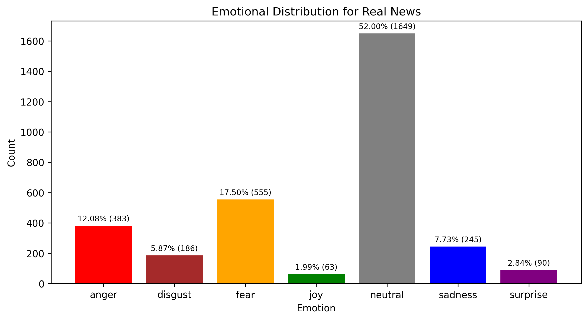
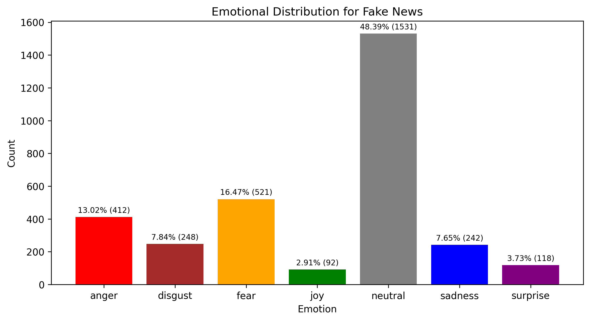

# Assignment 4 - Using finetuned transformers via HuggingFace

In previous assignments, you've done a lot of model training of various kinds of complexity, such as training document classifiers or RNN language models. This assignment is more like Assignment 1, in that it's about *feature extraction*.

For this assignment, you should use ```HuggingFace``` to extract information from the *Fake or Real News* dataset that we've worked with previously.

You should write code and documentation which addresses the following tasks:

- Initalize a ```HuggingFace``` pipeline for emotion classification
- Perform emotion classification for every *headline* in the data
- Assuming the most likely prediction is the correct label, create tables and visualisations which show the following:
  - Distribution of emotions across all of the data
  - Distribution of emotions across *only* the real news
  - Distribution of emotions across *only* the fake news
- Comparing the results, discuss if there are any key differences between the two sets of headlines


## Tips
- I recommend using ```j-hartmann/emotion-english-distilroberta-base``` like we used in class.
- Spend some time thinking about how best to present you results, and how to make your visualisations appealing and readable.
- **MAKE SURE TO UPDATE YOUR README APPROPRIATELY!**

# Assignment 4 - Luke Ring (202009983)




