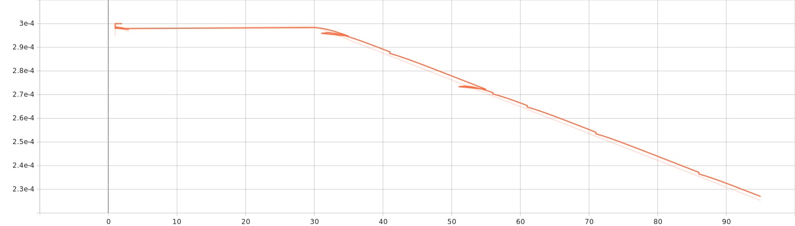
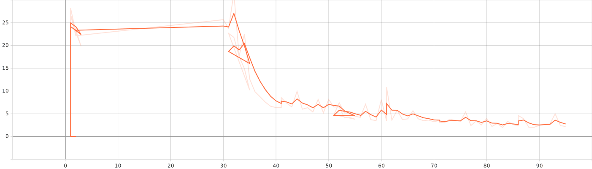
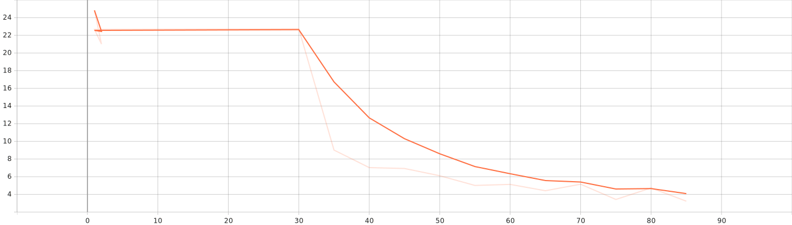

# Assignment 5: Unsupervised Pre-training Using Flan-T5

## Description

This assignment self-assigned, and is the final assignment for Cultural Data Science - Language Analytics.

For this assignment, I wanted to try and create a way to interface with my notes, in particular I use [Obsidian](https://obsidian.md/) which uses Markdown files for notes. As such, there are many approaches to creating a language model that can be used to glean information from these notes, including using the "summary/summarize" method, although this requires a lot of manual work, or using another network to generate summaries of the notes. Instead, I wanted to see if there was a way to add the information in the notes in an unsupervised way, which is possible using different methods. Taking inspiration from (Suichan Li et al., [2021](#2021)), I wanted to see if I could create a language model that could be used to interact with my notes. This can easily be updated and potentially integrated directly into Obsidian by creating a plugin to interface with the model.

<a id="2021"></a>Suichan Li et al., 2021. Unsupervised Finetuning. arXiv:2110.09510 [cs.CV] [https://arxiv.org/abs/2110.09510](https://arxiv.org/abs/2110.09510)

## Assignment 5, Luke Ring

Repository: [https://github.com/zeyus/cds-language-exam/tree/main/assignment_5](https://github.com/zeyus/cds-language-exam/tree/main/assignment_5)

### Contribution

This assignment was completed by me individually and independently, the code contained in this repository is my own work.

### Setup

This assignment uses PyTorch and HuggingFace Transformers. Fine tuning was done using CUDA 11.8 on an NVIDIA GeForce GTX 1070 GPU with 8GB VRAM on a system with 24GB RAM.

#### Prerequisites

- Python 3.11

#### Installation

Clone the repository:
  
```bash
git clone https://github.com/zeyus/cds-language-exam
cd cds-language-exam/assignment_5
```

Install requirements:

```bash
pip install -r requirements.txt
```

### Usage

The script can be run from the command line as follows:

```bash
python3 src/obsidianlm.py
```

The arguments available can be found by running:

```bash
python3 src/obsidianlm.py --help
```

Output:

```text
usage: obsidianlm.py [-h] [--version] [-o OUTPUT_PATH] [-b BATCH_SIZE] [-V VAULT_PATH]

ObsidianLM: Create a model of your brain.

options:
  -h, --help            show this help message and exit
  --version             show program's version number and exit
  -o OUTPUT_PATH, --output-path OUTPUT_PATH
                        Path to save the output, figures, stats, etc. (default: out)
  -b BATCH_SIZE, --batch-size BATCH_SIZE
                        Batch size for training. (default: 4)
  -V VAULT_PATH, --vault-path VAULT_PATH
                        Path to your obsidian vault. (default: vault)
```

### Implementation

The base model used for this project is the [Flan-T5-Base](https://huggingface.co/google/flan-t5-base) model, it is interesting because it can respond to various prompts and perform different language tasks.

In order to adapt the model to my notes, the markdown files are loaded and then tokenized. As part of the preprocessing steps, the special sentinal tokens are inserted into the text and the corresponding values are added to the labels.

The model is then trained on the data, and the loss is calculated. The loss is then used to update the model weights, and the process is repeated for the number of epochs specified.

### Results


Training learning rate: 



Training loss:



Validation loss:




Due to memory leak issues, the graphs look like there are some duplicate data points because the model training had to be resumed from saved checkpoints.

The results of some inference tests were not very good, although it's possible that some tweaking of the preprocessing and tokenization could result in a massive improvement. I will definitely be pursuing this further.


### Future Improvements

There are many ways this problem could be approached, including trying a different model completely, but assuming that Flan-T5-Base is used, there are a few ways that the model could be improved.

- Data preprocessing: Instead of treating each file individually, the files could be concatenated first into a single long string, and then chunked into the max token length (512 for Flan-T5-Base). This would allow the model to learn from the context of the entire vault, instead of just the individual files.
- Labelled data: Manual (or model-created, curated) summaries could be added to the data as a way to improve the model's ability to summarize the notes, specifically in the context of my notes from university.
- Optimizer: The optimizer used was adafactor, which is a good general optimizer, but it is possible that using a different optimizer could improve the model's performance.
- Batch size, etc: Due to GPU memory constraints, the batch size was set to 1, but this could be increased if the model was trained on a GPU with more memory. The number of epochs could also be increased, but the model was trained for 1.62 epochs, due to time constraints.
- specific tasks: The model could be trained on specific tasks, such as summarization, or question answering, which would allow the model to be more specific in its responses, rather than filling in the blanks.