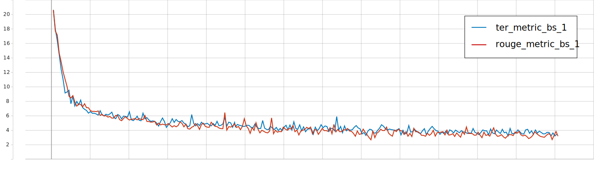
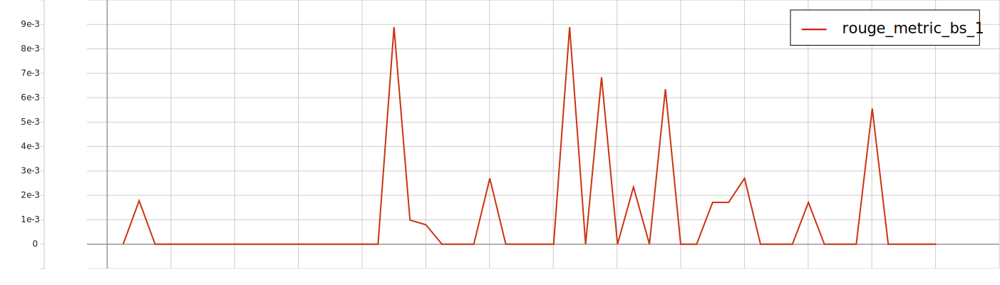
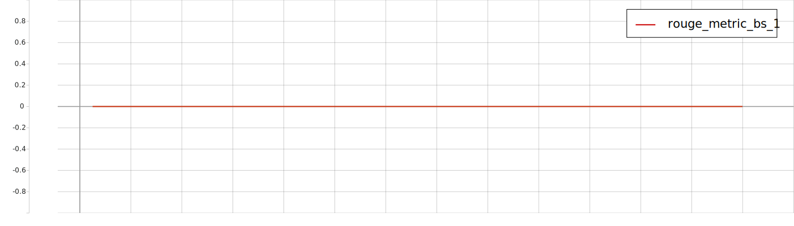
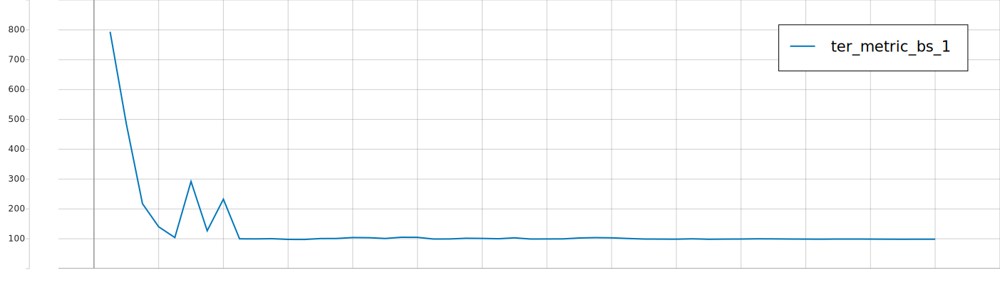
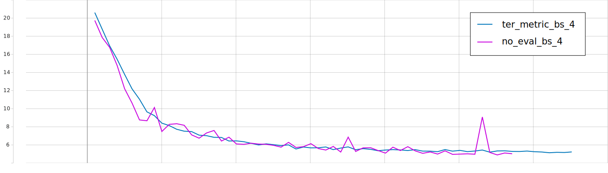
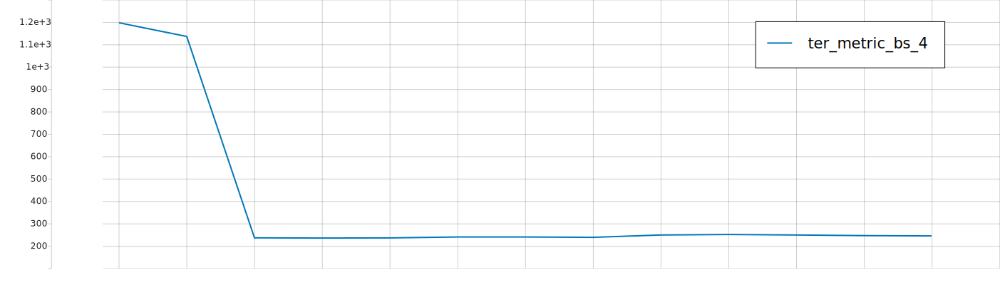
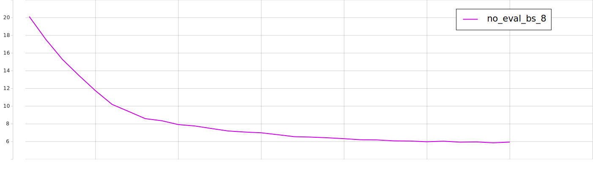

# Assignment 5: Unsupervised Pre-training Using Flan-T5

## Description

This assignment self-assigned, and is the final assignment for Cultural Data Science - Language Analytics.

For this assignment, I wanted to try and create a way to interface with my notes, in particular I use [Obsidian](https://obsidian.md/) which uses Markdown files for notes. As such, there are many approaches to creating a language model that can be used to glean information from these notes, including using the "summary/summarize" method, although this requires a lot of manual work, or using another network to generate summaries of the notes. Instead, I wanted to see if there was a way to add the information in the notes in an unsupervised way, which is possible using different methods. Taking inspiration from (Suichan Li et al., [2021](#2021)), I wanted to see if I could create a language model that could be used to interact with my notes. This can easily be updated and potentially integrated directly into Obsidian by creating a plugin to interface with the model.

<a id="2021"></a>Suichan Li et al., 2021. Unsupervised Finetuning. arXiv:2110.09510 [cs.CV] [https://arxiv.org/abs/2110.09510](https://arxiv.org/abs/2110.09510)

## Assignment 5, Luke Ring

Repository: [https://github.com/zeyus/cds-language-exam/tree/main/assignment_5](https://github.com/zeyus/cds-language-exam/tree/main/assignment_5)

### Contribution

This assignment was completed by me individually and independently, the code contained in this repository is my own work.

### Setup

This assignment uses PyTorch and HuggingFace Transformers. Fine tuning was done using CUDA 11.8 on an NVIDIA GeForce GTX 1070 GPU with 8GB VRAM on a system with 24GB RAM.

#### Prerequisites

- Python 3.11

#### Installation

Clone the repository:
  
```bash
git clone https://github.com/zeyus/cds-language-exam
cd cds-language-exam/assignment_5
```

Install requirements:

```bash
pip install -r requirements.txt
```

If you wish to use rouge to evaluate the model, you will need to install the nltk punkt package:

```bash
python -m nltk.downloader punkt
```

Additionally, apex is required for using the Fused AdamW optimization algorithm (and apex provides additional performance enhancements to the base T5 model), this can be compiled in windows by following [my instructions](https://gist.github.com/zeyus/44aca39866d044a5ad1e8711e14ba9c1) or for other operating systems, please use the official documentation available [on the NVIDIA/apex github repository](https://github.com/NVIDIA/apex/tree/2958e06e094146798ae42a748a77a509fd4695a0).

### Usage

The script can be run from the command line as follows:

```bash
python src/obsidianlm.py
```

The arguments available can be found by running:

```bash
python src/obsidianlm.py --help
```

Output:

```text
usage: obsidianlm.py [-h] [--version] [-o OUTPUT_PATH] [-b BATCH_SIZE] [-V VAULT_PATH]

ObsidianLM: Create a model of your brain.

options:
  -h, --help            show this help message and exit
  --version             show program's version number and exit
  -o OUTPUT_PATH, --output-path OUTPUT_PATH
                        Path to save the output, figures, stats, etc. (default: out)
  -b BATCH_SIZE, --batch-size BATCH_SIZE
                        Batch size for training. (default: 4)
  -V VAULT_PATH, --vault-path VAULT_PATH
                        Path to your obsidian vault. (default: vault)
```

### Implementation

#### Model

The base model used for this project is the [Flan-T5-Base](https://huggingface.co/google/flan-t5-base) model, it is interesting because it can respond to various prompts and perform different language tasks.

This implementation used the [T5ForConditionalGeneration](https://huggingface.co/docs/transformers/model_doc/t5#transformers.T5ForConditionalGeneration) class which includes a language modelling head from the [HuggingFace Transformers](https://huggingface.co/transformers/) library.


#### Data

In order to adapt the model to my notes, the markdown files are loaded from my Obsidian Notes directory, the text is read in and used as the dataset for the model. Using this data for fine tuning should allow the model to give more relevant results if I want to get summaries of my notes or questions about specific sections in the notes.

##### Data Preprocessing

As part of the preprocessing steps, the special sentinal tokens are inserted into the text and the corresponding values are added to the labels. This masking is done in a probabilistic way (by default with a 0.15 probability of masking) and sequential token masking is prevented. A simple representation of what the masked input and labels would look like is shown below:

```text
Raw input: "The cat sat on the mat."
Masked input: "The <extra_id_1> sat on the <extra_id_2>."
Labels: "<extra_id_1> cat <extra_id_2> mat"
```

The `<extra_id_n>` tokens are the sentinel tokens where the model should fill in the blanks. The labels are the tokens that should be predicted by the model. The `T5Tokenizer` class allows up to 100 sentinel tokens, and the preprocessing steps ensured that there were never more than 100 sentinel tokens in the input.

#### Unsupervised Training and Evaluation

The models were trained for up to 4 epochs, and batched with either a batch size of 1 or 4 or 8. The batch size could be 8 when no evaluation was done, 4 when the evaluation dataset was extremely small, otherwise a batch size of 1 due to insufficient GPU memory available for the evaluation step.

Training the model with my notes was done in an unsupervised, programmatic way, where the model by default during training will try to minimize the Cross-Entropy Loss, and the authors describe that one of the advantages of the T5 model is that the same loss function can be used across various tasks[^1] . While this means that evaluation isn't strictly necessary, I was interested in seeing the results of different evaluation metrics, and how they compared to the model's loss.

[^1]: [Raffel et al, 2020: Exploring the Limits of Transfer Learning with a Unified Text-to-Text Transformer. arXiv:1910.10683](https://arxiv.org/abs/1910.10683)


##### Evaluation metrics

Training runs were done with and without evaluation, evaluation runs were performed for both the [ROUGE](https://github.com/huggingface/evaluate/blob/main/metrics/rouge/README.md) and [TER](https://github.com/huggingface/evaluate/blob/main/metrics/ter/README.md) metrics.

**Rouge** is a metric that measures the overlap between the model's output and the reference. The higher the score, the more overlap there is between the model's output and the reference, indicating a better match. Rouge can provide various scores, including Rouge-1, Rouge-2, and Rouge-L, which are the unigram, bigram, and longest common subsequence scores respectively. The metric calculation used the Porter stemmer so that word suffixes were ignored when comparing the model's output and the reference, this is done by passing the `use_stemmer=True` argument to the `rouge.compute()` function.

**TER** measures the number of edits required to transform the model's output to match the reference. The lower the score, the less changes are required to transform the model output to the supplied reference, indicating a better match. The metric calculation was done in a case-insensitive way, and was configured to ignore punctuation and normalize the sentences by passing the `ignore_punctuation=True` and `normalize=True` arguments to the `ter.compute()` function.

Using runs with both of the metrics as well as runs without evaluation, the results can be compared to see if the evaluation metrics are useful for determining the best model. Intuitively it would be easy to assume that the evaluation metrics should help determine the best model, but for tasks like summarization and question answering, there could be many "correct" answers that are not the same as a provided reference which would give the model a lower score despite it answering correctly.

Due to the rouge score calulation taking an extremely long time, rouge was only calculated for one run with a batch size of 1.

### Results


#### Batch Size 1


Training loss:



##### Rouge

Rouge1 Score:



Rouge2 Score:



##### TER

TER Score:



#### Batch Size 4

Training loss:



##### TER

TER Score:



#### Batch Size 8

Training loss:




### Discussion

The graphs above show that the evaluation scores never got to a decent level for either the TER or ROUGE metrics, but in all models, the loss continued to decrease as the training continued. This indicates that the model is learning, but the evaluation metrics are possibly not so useful for determining the best model for this particular case.

That said, all of the models are able to provide answers to some questions as well as summarize some notes, which is great and shows potential for further improvement in the training and inference steps.

#### Inference Examples

Examples are generated from the ROUGE evaluation run with a batch size of 1 as well as the TER evaluation run with a batch size of 4 and the no evluation run with a batch size of 8. I will use the last checkpoint form each run to generate the examples, as the "best score" isn't necessarily the best model, and the last checkpoint will have one of the lower loss scores for each batch size.

The examples are generated by running the following:

```bash
python src/obsidianlm.py -p "<prompt>" -i "<path/to/checkpoint/for/inference>"
```

The format is based on some of the training examples from the [FLAN templates](https://github.com/google-research/FLAN/blob/main/flan/v2/flan_templates_branched.py).

**Prompt 1**

> Question: Which models are used in this course? Context: This course wraps up the series of methods courses. We look at modelling from a birds-eye view, introducing advanced concepts and revisiting methods introduced in earlier courses from a comprehensive Bayesian perspective. We introduce causal reasoning using directed acyclic graphs (DAGs), mixture models, Gaussian processes, learn to deal with measurement error and missing data; and we revisit regression modelling, generalized linear models, multilevel modelling, Markov chain Monte Carlo sampling, learning to implement them using probabilistic programming.

*Response 1 (batch size 1)*

> Bayesiansssssssssssssss.sssssssssssssssssssssssssssssssssssssssssssssssssssssssssssssssssssssssssssssssss.ssssssssssssssssssssssssssssssssssssssssssssssssssssssssssssssssssssssssssssssssssssssssssssssssssssssssssssssssssssssssssssssssssssssssssssssssssssssssssss

*Response 1 (batch size 4)*

> directed acyclic graphs (DAGs), mixture models, Markov chain Monte Carlo

*Response 1 (batch size 8)*

> directed acyclic graphs (DAGs), mixture models, Gaussian processes, learn to deal with measurement error and missing data; and we revisit regression modelling, generalized linear models, multilevel modelling, Markov chain Monte Carlo sampling, learning to implement them using probabilistic programming models models models models models


**Prompt 2**

> Question: Which frequencies are used in this experiment? Context: The experimental design will both replicate and augment a prior study[1] that used 4 tones with fixed frequencies (40 Hz, 500 Hz, 5000 Hz and 15,000 Hz) played back to participants for at least 15 seconds each while their eyes are closed. Our experiment will use those same 4 tones, and will add additional tones with smaller frequency differences to attempt to find a minimum frequency difference that is distinguishable from EEG readings. In order to train a machine learning model using a single participant, the range of tones will be played multiple times (within the time constraints) and models will be trained on labelled subsets of the recorded EEG data.

*Response 2 (batch size 1)*

> 40 Hz, 500 Hz, 5000 Hz and 15,000 Hz to. to. to. to................................................................................................................................................................................................................................................

*Response 2 (batch size 4)*

> 40 Hz, 500 Hz, 5000 Hz and 15,000 Hz Hz Hz Hz Hz Hz Hz Hz Hz Hz Hz Hz Hz Hz Hz Hz Hz Hz Hz Hz Hz Hz Hz Hz Hz Hz Hz Hz Hz Hz Hz Hz Hz Hz Hz Hz Hz Hz Hz Hz Hz Hz Hz Hz Hz Hz Hz Hz Hz Hz Hz Hz Hz Hz Hz Hz Hz Hz Hz Hz Hz Hz Hz Hz Hz Hz Hz Hz Hz Hz Hz Hz Hz Hz Hz Hz Hz Hz Hz Hz Hz Hz Hz Hz Hz Hz Hz Hz Hz Hz Hz Hz Hz Hz Hz Hz Hz Hz Hz Hz Hz Hz Hz Hz Hz Hz Hz Hz Hz Hz Hz Hz Hz Hz Hz Hz Hz Hz Hz Hz Hz Hz Hz Hz Hz Hz Hz Hz Hz Hz Hz Hz Hz Hz Hz Hz Hz Hz Hz Hz Hz Hz Hz Hz Hz Hz Hz Hz Hz Hz Hz Hz Hz Hz Hz Hz Hz Hz Hz Hz Hz Hz Hz Hz Hz

*Response 2 (batch size 8)*

> fixed frequencies (40 Hz, 500 Hz, 5000 Hz and 15,000 Hz) played back to participants for at least 15 seconds each while their eyes are closed. Our experiment will use those same 4 tones, and will add additional tones with smaller frequency differences to attempt to find a minimum frequency difference that is distinguishable from EEG readings. In order to train a machine learning model using a single participant, the range of tones will be played multiple times (within the time constraints) and models will be trained on labelled subsets of the recorded EEG data.,,

**Prompt 3**

> Write a question you would see in a school textbook.

*Response 3 (batch size 1)*

> 

(no output)

*Response 3 (batch size 4)*

> Which of the following statements is true?

*Response 3 (batch size 8)*

> Which of the following is a characteristic characteristic of a living thing?.......................................................................................................................................................................................................................................................

**Prompt 4**

> Generate a context and a hypothesis.

*Response 4 (batch size 1)*

>  Context Context Context Context Context Context Context Context Context Context Context Context Context Context Context Context Context Con Context Con Con Con Con Con Con Con Con Con Con Con Con Con Con Con Con Con Con Con Con Con Con Con Con Con Con Con Con Con Con Con Con Con Con Con Con Con Con Con Con Con Con Con Con Con Con Con Con Con Con Con Con Con Con Con Con Con Con Con Con Con Con Con Con Con Con Con Con Con Con Con Con Con Con Con Con Con Con Con Con Con Con Con Con Con Con Con Con Con Con Con Con Con Con Con Con Con Con Con Con Con Con Con Con Con Con Con Con Con Con Con Con Con Con Con Con Con Con Con Con Con Con Con Con Con Con Con Con Con Con Con Con Con Con Con Con Con Con Con Con Con Con Con Con Con Con Con Con Con Con Con Con Con Con Con Con Con Con Con Con Con Con Con Con Con Con Con Con Con Con Con Con Con Con Con Con Con Con Con Con Con Con Con Con Con Con Con Con Con Con Con Con Con Con Con Con Con Con Con Con Con Con Con Con Con Con Con Con Con Con Con Con Con Con Con Con Con Con Con Con Con Con Con Con Con Con Con Con Con Con Con Con Con Con Con Con Con Con Con Con Con Con Con Con Con Con Con Con Con Con Con Con Con Con Con Con Con Con Con Con Con Con Con Con Con Con Con Con Con Con Con Con Con Con Con Con Con Con Con Con Con Con Con Con Con Con Con Con Con Con Con Con Con Con Con Con Con Con Con Con Con Con Con Con Con Con Con Con Con Con Con Con Con Con Con Con Con Con Con Con Con Con Con Con Con Con Con Con Con Con Con Con Con Con Con Con Con Con Con Con Con Con Con Con Con Con Con Con Con Con Con Con Con Con Con Con Con Con Con Con Con Con Con Con Con Con Con Con Con Con Con Con Con Con Con Con Con Con Con Con Con Con Con Con Con Con Con Con Con Con Con Con Con Con Con Con Con Con Con Con Con Con Con Con Con Con Con Con Con Con Con Con Con Con Con Con Con Con Con Con Con Con Con Con Con Con Con Con Con Con Con Con Con Con Con Con Con Con Con Con Con Con Con Con Con Con Con Con Con Con Con Con Con Con Con Con Con Con Con Con Con Con Con Con Con Con Con Con Con Con Con Con Con Con

*Response 4 (batch size 4)*

> Context: This is a list of the United States Air Force bases in the United States of America. The United States Air Force base in the United States of America is located in Washington, D.C. The United States Air Force base in Washington, D.C. is located in Washington, D.C. Hypothesis: The United States Air Force base in Washington, D.C. is located in Washington, D.C.: The United States Air Force base in Washington, D.C. is located in Washington, D.C.: The United States Air Force base in Washington, D.C. is located in Washington, D.C.: The United States Air Force base in Washington, D.C. is located in Washington, D.C.: The United States Air Force base in Washington, D.C. is located in Washington, D.C. Hypothesis: The United States Air Force base in Washington, D.C. is located in Washington, D.C.: The United States Air Force base in Washington, D.C. is located in Washington, D.C.: The United States Air Force base in Washington, D.C. is located in Washington, D.C.: The United States Air Force base in Washington, D.C. is located in Washington, D.C.: The United States Air Force base in Washington, D.C. is located in Washington, D.C. Hypothesis: The United States Air Force base in Washington, D.C. is located in Washington, D.C.: The United States Air Force base in Washington, D.C. is located in Washington, D.C.: The United States Air Force base in Washington, D.C. is located in Washington, D.C.: The United States Air Force base in Washington, D.C. is located in Washington, D.C.: The United States Air Force base in Washington, D.C. is located in Washington, D.C.: The United States Air Force base in Washington, D.C. is located in Washington, D.C.: The United States Air Force base in Washington, D.C. is located in Washington, D.C.: The United States Air Force base in Washington, D.C. is located in Washington, D.C.: The United States Air Force base in Washington,

*Response 4 (batch size 8)*

> Context: How to prepare for a weddingbr>Determine what type of wedding you are planning to have. If you are planning on having a wedding in the near future, you may want to consider having a wedding in the near future. Hypothesis: Weddings in the near future are more likely to have a wedding in the near future.t weddings in the near future are more likely to have a wedding in the near future.t weddings in the near future are more likely to have a wedding in the near future.t weddings in the near future are more likely to have a wedding in the near future.t weddings in the near future are more likely to have a wedding in the near future.t weddings in the near future are more likely to have a wedding in the near future.t weddings in the near future are more likely to have a wedding in the near future.t weddings in the near future are more likely to have a wedding in the near future.t weddings in the near future are more likely to have a wedding in the near future.t weddings in the near future are more likely to have a wedding in the near future.t weddings in the near future are more likely to have a wedding in the near future.t weddings in the near future are more likely to have a wedding in the near future.t weddings in the near future are more likely to have a wedding in the near future.t weddings in the near future are more likely to have a wedding in the near future.t weddings in the near future are more likely to have a wedding in the near future.t weddings in the near future are more likely to have a wedding in the near future.t weddings in the near future are more likely to have a wedding in the near future.t weddings in the near future are more likely to have a wedding in the near future.t weddings in the near future are more likely to have a wedding in the near future.t weddings in the near future are more likely to have a wedding in the near future.t weddings in the near future are more likely to have a wedding in the near future.t weddings in the near future are more likely to have

**Prompt 5**

> Complete the following sentence.
> 
> Cognitive Science is a

*Response 5 (batch size 1)*

> :..............................................................................................................................................................................................................................................................

*Response 5 (batch size 4)*

> scientific field..............................................................................................................................................................................................................................................................

*Response 5 (batch size 8)*

> scientific discipline...............................................................................................................................................................................................................................................................

#### Discussion of Inference Examples

The above examples show some quite good output, but also indicate a few issues, including the model with batch size of 1 seems to be corrupted, and all examples seem to have trailing or repetitive output. Although I am using the model's tokenizer to decode the output, it could be that the end of string token is either not generated correctly, or the decoding also includes tokens after the EOS token.
### Future Improvements

There are many ways this problem could be approached, including trying a different model completely, but assuming that Flan-T5-Base is used, there are a few ways that the model could be improved.

- Data preprocessing: Instead of treating each file individually, the files could be concatenated first into a single long string, and then chunked into the max token length (512 for Flan-T5-Base). This would allow the model to learn from the context of the entire vault, instead of just the individual files.
- Labelled data: Manual (or model-created, curated) summaries could be added to the data as a way to improve the model's ability to summarize the notes, specifically in the context of my notes from university.
- specific tasks: The model could be trained on specific tasks, such as summarization, or question answering, which would allow the model to be more specific in its responses, rather than filling in the blanks.


### Conclusion

Using a Flan-T5 based model and fine tuning it on personalized data seems like a promising option to help with reviewing and finding information in notes, emails, etc. With little effort, the context could be provided as part of a plugin, meaning you could use the model to interact directly with the application.

The whole process has given me a much deeper insight into language modelling and what is involved, including performance optimization and memory management, as well as programatically creating the sentinel tokens, and how different parameters such as attention masking are used.